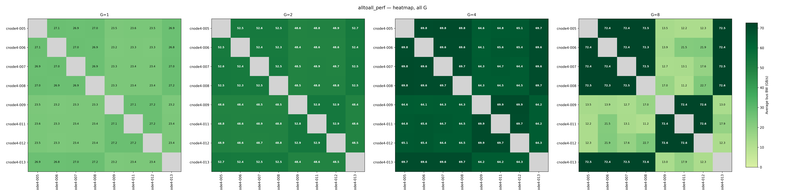

<h1 align="center">
NCCL Tests Cluster
</h1>

<p align="center">
Automated Inter-node bandwidth testing and visualization for GPU clusters using NCCL.
</p>

<p align="center">
  
  <br/>
  <sub>Example heatmap of an 8-node H100 cluster (alltoall_perf, all G values)</sub>
</p>

<p align="center">
  
  <br/>
  <sub>Example heatmap of a 17-node H100 cluster (alltoall_perf, all G values)</sub>
</p>


**Key Features:**

- Run single-node [NCCL tests](https://github.com/NVIDIA/nccl-tests) for intra-node performance evaluation
- Run pairwise NCCL tests across all node combinations for inter-node evaluation
- Parse logs and generate summary reports (CSV/Markdown)
- Visualize network bandwidth with heatmaps (and optional topology graphs)
- Support for [SLURM](https://slurm.schedmd.com/documentation.html) clusters

**Testing Strategy:**

- **Single-node tests**: Evaluate intra-node GPU communication performance on each node individually
- **Pairwise tests**: For N nodes, test all pairs (e.g., 4 nodes → 6 pairs: A-B, A-C, A-D, B-C, B-D, C-D) to evaluate inter-node communication

## Table of Contents <!-- omit in toc -->

- [Quick Start](#quick-start)
- [Motivation](#motivation)
- [Limitations](#limitations)
- [Project Structure](#project-structure)
- [Prerequisites](#prerequisites)
  - [Clone Repository and Build NCCL](#clone-repository-and-build-nccl)
  - [Python Environment](#python-environment)
- [Usage](#usage)
  - [Run NCCL Tests (Single-Node)](#run-nccl-tests-single-node)
  - [Run NCCL Tests (Pairs)](#run-nccl-tests-pairs)
  - [Run NCCL Tests (Multi-Node)](#run-nccl-tests-multi-node)
  - [Quick Smoke Test](#quick-smoke-test)
  - [Summarize Logs](#summarize-logs)
  - [Generate Bandwidth Plots](#generate-bandwidth-plots)
  - [Generate Heatmaps](#generate-heatmaps)
- [Configuration](#configuration)
  - [Default Test Parameters](#default-test-parameters)
  - [Default Test Binaries](#default-test-binaries)
  - [Environment Variable Overrides](#environment-variable-overrides)
- [Useful Links](#useful-links)
- [Troubleshooting](#troubleshooting)
- [Known Issues](#known-issues)

## Quick Start

Get started in 3 steps:

```bash
# 1. Build NCCL and NCCL tests
bash build_nccl_and_tests.sh

# 2. Set up Python environment (for log parsing & visualization)
uv venv && source .venv/bin/activate && uv pip install -r requirements.txt

# 3. Run a smoke test to verify everything works
bash sbatch_run_nccl_tests_smoke.sh -p <your-partition> -c <cluster-name> -n "node1,node2"
```

After the smoke test completes, check the results in `benchmarks/<cluster-name>/nccl-benchmark-results/smoke/latest/`.

For full pairwise testing with visualization:

```bash
# Run pairwise tests
bash sbatch_run_nccl_tests_pairs.sh -p <partition> -c <cluster> -n "node[01-04]"

# Summarize logs
python summarize_nccl_logs.py --input benchmarks/<cluster>/nccl-benchmark-results/pairwise/latest/without-debug/logs

# Generate heatmaps
python generate_topology.py --csv benchmarks/<cluster>/nccl-benchmark-results/pairwise/latest/without-debug/summary.csv --all
```

## Motivation

**[NVIDIA’s NCCL Tests](https://github.com/NVIDIA/nccl-tests)** already provides a reliable and privilege-free way to benchmark GPU communication performance. However, in real-world HPC or cloud environments, users without administrative access often face limited visibility into the system. Tools such as [NVIDIA DCGM](https://developer.nvidia.com/dcgm) or low-level network profilers are typically unavailable, making it difficult to obtain a clear picture of inter-node communication performance.

This raises a practical challenge:

**How can we systematically evaluate and visualize inter-node bandwidth patterns in a GPU cluster without relying on administrative tools or privileges?**

_NCCL Tests Cluster_ bridges this gap by automating and extending NCCL Tests for scalable, user-level performance evaluation. It enables users to:

- **Automatically run pairwise NCCL benchmarks** across all node combinations
- **Parse and summarize logs** into structured CSV/Markdown reports
- **Visualize network bandwidth** with heatmaps (and optional topology graphs)

Together, these capabilities extend NCCL testing into a fully automated and scalable workflow—making it easier to verify cluster health, identify communication bottlenecks, and optimize resource allocation even without system-level monitoring tools.

## Limitations

- **Scheduler**: Only SLURM is supported currently
- **GPU/NIC Selection**:
  - No automatic testing of all GPU/NIC combinations
  - Manual configuration via environment variables (e.g., `CUDA_VISIBLE_DEVICES`, NCCL variables) is possible
  - GPU/NIC details are only visible in debug logs (`--debug` enables `NCCL_DEBUG=INFO`)
- **Test Configuration**: Pairwise (N=2) and multi-node (N>=2) scripts are available; topology graphs currently target pairwise summaries.

## Project Structure

Results are now organized by **test type first, then run ID**, so you can browse or cleanly remove entire test classes. Each test type keeps its own `latest` symlink.

```bash
benchmarks/
  {cluster_name}/
    nccl-benchmark-results/
      single-node/
        runs/
          <RUN_ID>/
            without-debug/
              logs/
              summary.csv
              summary.md
              plots/           # Bandwidth plots (message size vs bandwidth)
            with-debug/
              logs/
              summary.csv
              summary.md
        latest -> runs/<RUN_ID>
      pairwise/
        runs/
          <RUN_ID>/
            without-debug/
              logs/
              topology/        # Heatmaps (and optional topology graphs)
              plots/           # Bandwidth plots
              summary.csv
              summary.md
            with-debug/
              ...
        latest -> runs/<RUN_ID>
      multi-node/
        runs/<RUN_ID>/...
        latest -> runs/<RUN_ID>
      smoke/
        runs/<RUN_ID>/logs
        latest -> runs/<RUN_ID>
    # other cluster docs/scripts
nccl/
  build/           # NCCL build (NCCL_HOME)
  nccl-tests/
    build/         # NCCL test binaries (NCCL_TEST)
lib/
  nccl_common.sh   # Shared shell functions for scripts
```

Reuse a `--run-id` to resume and fill in missing logs. The `latest` symlink is set per test type (single-node, pairwise, multi-node, smoke).

## Prerequisites

### Clone Repository and Build NCCL

For convenience, it is recommended to clone this repository into `$HOME/` by default. Otherwise, you might need to modify the paths in `sbatch_run_nccl_tests_pairs.sh` accordingly.

```bash
cd $HOME
git clone https://github.com/xxrjun/nccl-tests-cluster.git
cd nccl-tests-cluster
```

> [!TIP]
> This project is build on [NVIDIA/nccl](https://github.com/nvidia/nccl) and [NVIDIA/nccl-tests](https://github.com/NVIDIA/nccl-tests). Please refer to their README files for more information about NCCL and NCCL tests.
>
> Or you can run with the provided build script `build_nccl_and_tests.sh` to build NCCL and NCCL tests automatically.

```bash
bash build_nccl_and_tests.sh
```

### Python Environment

Install required packages for log parsing and visualization.

**Option 1: Using [uv](https://docs.astral.sh/uv/) (recommended)**

If you don't have `uv` installed, you can install it via

```bash
curl -LsSf https://astral.sh/uv/install.sh | sh
source $HOME/.local/bin/env
```

Create and activate a virtual environment, then install the required packages

```bash
uv venv
source .venv/bin/activate
uv pip install -r requirements.txt
```

**Option 2: Using pip**:

```bash
pip install -r requirements.txt
```

## Usage

### Run NCCL Tests (Single-Node)

> Plotting feature is ongoing for single-node tests.

Test intra-node GPU communication performance on individual nodes.

**View help:**

```bash
bash sbatch_run_nccl_tests_single.sh --help
```

**Basic usage:**

```bash
# Test all nodes in a partition with default GPU counts (4, 8)
bash sbatch_run_nccl_tests_single.sh -p gpu-partition -c cluster00

# Test specific nodes
bash sbatch_run_nccl_tests_single.sh -p gpu-partition -c cluster00 -n "cnode-[001-004]"

# Custom GPU counts
bash sbatch_run_nccl_tests_single.sh -p gpu-partition -c cluster00 --gpn "2 4 8"

# Dry run (preview without submitting)
bash sbatch_run_nccl_tests_single.sh -p gpu-partition -c cluster00 --dry-run

# Enable debug mode
bash sbatch_run_nccl_tests_single.sh -p gpu-partition -c cluster00 --debug

# Resume a prior run (skips existing logs)
bash sbatch_run_nccl_tests_single.sh -p gpu-partition -c cluster00 --run-id 20250114-153012
```

**Example output:**

```bash
Submitting 4 single-node jobs...
  cnode-001
  cnode-002
  cnode-003
  cnode-004
Submit: NCCL_N1_G4_cnode-001  --nodelist=cnode-001  --gpus-per-node=4
Submitted batch job 1234
# ...
==========================================
Submission Summary
==========================================
Total nodes:    4
Jobs per node:  2
Total jobs:     8
Submitted:      8
Skipped:        0
DRY RUN:        0
NCCL DEBUG:     0
==========================================
```

### Run NCCL Tests (Pairs)

Test inter-node GPU communication performance across all node pairs.

**View help:**

```bash
bash sbatch_run_nccl_tests_pairs.sh --help
```

**Basic usage:**

```bash
# Test all node pairs in a partition with default GPU counts (1, 2, 4, 8)
bash sbatch_run_nccl_tests_pairs.sh -p gpu-partition -c cluster00

# Test specific nodes
bash sbatch_run_nccl_tests_pairs.sh -p gpu-partition -c cluster00 -n "cnode-[001-004]"

# Custom GPU counts
bash sbatch_run_nccl_tests_pairs.sh -p gpu-partition -c cluster00 --gpn "2 4 8"

# Dry run (preview without submitting)
bash sbatch_run_nccl_tests_pairs.sh -p gpu-partition -c cluster00 --dry-run

# Enable debug mode
bash sbatch_run_nccl_tests_pairs.sh -p gpu-partition -c cluster00 --debug

# Resume a prior run (skips existing logs)
bash sbatch_run_nccl_tests_pairs.sh -p gpu-partition -c cluster00 --run-id 20250114-153012
```

> [!TIP]
> It is highly recommended to first test with only two nodes to verify that your NCCL environment is working correctly:
>
> ```bash
> bash sbatch_run_nccl_tests_pairs.sh -p gpu-partition -c cluster00 -n "cnode-[001-002]"
> ```

**Example output:**

```bash
Submitting 6 pairs...
  cnode-001,cnode-002
  cnode-001,cnode-003
  # ...
==========================================
Submission Summary
==========================================
Total pairs:    6
Jobs per pair:  4
Total jobs:     24
Submitted:      24
Skipped:        0
DRY RUN:        0
NCCL DEBUG:     0
==========================================
```

**Cancel jobs if needed:**

```bash
scancel -u $USER
```

**Common CLI Options:**
| Option             | Description                                               | Default                                                                                    |
| ------------------ | --------------------------------------------------------- | ------------------------------------------------------------------------------------------ |
| `-p, --partition`  | SLURM partition name                                      | Required                                                                                   |
| `-c, --cluster`    | Cluster name for log organization                         | `cluster00`                                                                                |
| `-n, --nodelist`   | Compressed nodelist (e.g., `"cnode-[001-004]"`)           | All nodes in partition                                                                     |
| `-r, --run-id`     | Run ID for timestamped results                            | `YYYYMMDD-HHMMSS`                                                                          |
| `-l, --log-dir`    | Custom log directory                                      | `benchmarks/<CLUSTER>/nccl-benchmark-results/<test-type>/runs/<RUN_ID>/without-debug/logs` |
| `--gpn`            | Space-separated GPU counts                                | Single: `"4 8"`, Pairs: `"1 2 4 8"`                                                        |
| `--dry-run`        | Preview commands without submitting                       | `false`                                                                                    |
| `--debug`          | Enable NCCL debug mode (affects performance)              | `false`                                                                                    |
| `--gpn` (comma ok) | GPU counts can also be comma-separated, e.g., `"1,2,4,8"` |

### Run NCCL Tests (Multi-Node)

Run one NCCL job across N>=2 nodes (not all pair combinations).

```bash
# Use first 4 nodes in the partition, 8 GPUs per node
bash sbatch_run_nccl_tests_multi.sh -p gpu-partition -c cluster00 --num-nodes 4 --gpn "8"

# Explicit nodelist
bash sbatch_run_nccl_tests_multi.sh -p gpu-partition -c cluster00 -n "cnode-[001-004]"

# Debug mode and custom tests (space-separated list)
RUN_BIN_LIST="all_reduce_perf all_gather_perf" \
bash sbatch_run_nccl_tests_multi.sh -p gpu-partition -c cluster00 --num-nodes 8 --gpn "4"

# Dry run
bash sbatch_run_nccl_tests_multi.sh -p gpu-partition --dry-run
```

### Quick Smoke Test

Fast two-node sanity check (all_reduce_perf + sendrecv_perf, small message sizes).

```bash
# Default: first two nodes in the partition, 1 GPU per node
bash sbatch_run_nccl_tests_smoke.sh -p gpu-partition -c cluster00

# Explicit nodes and debug
bash sbatch_run_nccl_tests_smoke.sh -p gpu-partition -c cluster00 -n "cnode-[001-002]" --debug
```

### Summarize Logs

Parse NCCL test logs and generate summary reports (CSV + Markdown).

```bash
# Process single-node test logs (latest run)
python summarize_nccl_logs.py --input benchmarks/cluster00/nccl-benchmark-results/single-node/latest/without-debug/logs

# Process pairwise test logs (latest run)
python summarize_nccl_logs.py --input benchmarks/cluster00/nccl-benchmark-results/pairwise/latest/without-debug/logs

# Batch mode: process both with-debug/ and without-debug/ for a run
python summarize_nccl_logs.py --input benchmarks/cluster00/nccl-benchmark-results/pairwise/latest

# Custom output paths
python summarize_nccl_logs.py \
  --input benchmarks/.../logs \
  --save-csv /path/to/summary.csv \
  --save-md  /path/to/summary.md
```

**Filename Format:**

- Single-node: `..._N1_G{G}_node.log` (e.g., `nccl_N1_G8_cnode-001.log`)
- Pairs: `..._N2_G{G}_node1_node2.log` (e.g., `nccl_N2_G8_cnode-005_cnode-006.log`)
- The `_debug` suffix is automatically ignored

### Generate Bandwidth Plots

Generate bandwidth vs message size plots for visualizing NCCL performance trends.

```bash
# Generate plots from single-node logs (all tests and G values)
python plot_nccl_bandwidth.py --input benchmarks/cluster00/nccl-benchmark-results/single-node/latest/without-debug/logs

# Filter by specific test
python plot_nccl_bandwidth.py --input ./logs --test all_reduce_perf

# Filter by GPU count
python plot_nccl_bandwidth.py --input ./logs --g 8

# Use algorithm bandwidth instead of bus bandwidth
python plot_nccl_bandwidth.py --input ./logs --metric algbw

# Save parsed data to CSV for further analysis
python plot_nccl_bandwidth.py --input ./logs --save-csv detailed_data.csv
```

**Output:** `plots/{test_name}/G{n}_{node}.png` (individual) + `G{n}_combined.png` (comparison)

**Key Options:**

- `--test NAME`: Filter by test name (e.g., `all_reduce_perf`)
- `--g N`: Filter by GPU count
- `--metric {busbw|algbw}`: Bandwidth metric (default: `busbw`)
- `--out-dir DIR`: Custom output directory
- `--save-csv FILE`: Export per-message-size data to CSV

Run `python plot_nccl_bandwidth.py --help` for all options.

### Generate Heatmaps

Visualize network bandwidth with heatmaps from `summary.csv`. By default, only heatmaps are generated; topology graphs require the `--topology` flag.

```bash
# Process all tests and G values (generates heatmaps only by default)
python generate_topology.py --csv benchmarks/cluster00/nccl-benchmark-results/pairwise/latest/without-debug/summary.csv --all

# Single test, all G values
python generate_topology.py --csv ./summary.csv --test alltoall_perf

# Also generate topology graphs (in addition to heatmaps)
python generate_topology.py --csv ./summary.csv --all --topology

# With custom styling
python generate_topology.py --csv ./summary.csv --all --topology \
  --vmin 0 --vmax 80 --layout shell --adjust-labels
```

**Output:** `topology/{test_name}/G{n}_heatmap.png` and `allG_heatmap.png` by default; add `--topology` to also generate `G{n}.png` + `allG.png` (combined grid)

**Key Options:**

- `--all`: Process all tests and G values
- `--test NAME`: Process specific test only
- `--topology`: Also generate topology graph PNG(s) in addition to heatmaps
- `--topology-only`: Generate only topology graphs (skip heatmaps)
- `--adjust-labels`: Auto-adjust overlapping labels (useful for dense graphs)
- `--layout`: Algorithm (`kamada`, `shell`, `spring`, `circular`, `bipartite`, `cluster`)
- `--heatmap-values {auto|on|off}`: Show numbers in heatmap cells (default `auto` for <=20 nodes)
- Color scale now floors to 0 by default to avoid misleading low-end colors; override with `--vmin`
- `--vmin/--vmax`: Bandwidth color scale range
- `--dpi`: Resolution (default: 300)

Run `python generate_topology.py --help` for all options.

## Configuration

Each script has sensible defaults that can be overridden via environment variables or CLI options.

### Default Test Parameters

| Parameter               | Single-Node | Pairwise   | Multi-Node | Smoke    |
| ----------------------- | ----------- | ---------- | ---------- | -------- |
| `MAXIMUM_TRANSFER_SIZE` | 16G         | 32G        | 64G        | 512M     |
| `MINIMUM_TRANSFER_SIZE` | 32M         | 4G         | 4G         | 32M      |
| `STEP_FACTOR`           | 2           | 2          | 2          | 2        |
| `ITERS_COUNT`           | 20          | 20         | 20         | 5        |
| `WARMUP_ITERS`          | 5           | 5          | 5          | 2        |
| `JOB_TIME_LIMIT`        | 00:30:00    | 00:50:00   | 00:50:00   | 00:05:00 |
| GPU counts (`--gpn`)    | 4, 8        | 1, 2, 4, 8 | 1, 2, 4, 8 | 1        |

> **Note**: `JOB_TIME_LIMIT` format is `HH:MM:SS` (hours:minutes:seconds).

### Default Test Binaries

| Script      | Default Binaries                                                                              |
| ----------- | --------------------------------------------------------------------------------------------- |
| Single-Node | `all_reduce_perf`, `all_gather_perf`, `reduce_scatter_perf`, `alltoall_perf`, `sendrecv_perf` |
| Pairwise    | `alltoall_perf`, `sendrecv_perf`                                                              |
| Multi-Node  | `all_reduce_perf`, `all_gather_perf`, `reduce_scatter_perf`, `alltoall_perf`, `sendrecv_perf` |
| Smoke       | `all_reduce_perf`, `sendrecv_perf`                                                            |

### Environment Variable Overrides

Override any default by setting environment variables before running scripts:

```bash
# Example: Custom transfer sizes and iterations
MAXIMUM_TRANSFER_SIZE=8G MINIMUM_TRANSFER_SIZE=1G ITERS_COUNT=50 \
  bash sbatch_run_nccl_tests_pairs.sh -p gpu-partition -c cluster00

# Example: Custom test binaries
RUN_BIN_LIST="all_reduce_perf alltoall_perf" \
  bash sbatch_run_nccl_tests_single.sh -p gpu-partition -c cluster00
```

## Useful Links

- [docs] [NVIDIA NCCL Documentation](https://docs.nvidia.com/deeplearning/nccl/user-guide/docs/index.html)
- [paper] [[2507.04786] Demystifying NCCL: An In-depth Analysis of GPU Communication Protocols and Algorithms](https://arxiv.org/abs/2507.04786)
- [paper] [[2510.20171] Collective Communication for 100k+ GPUs](https://arxiv.org/abs/2510.20171)


## Troubleshooting

> [!TIP]
> If you encounter issues related to NCCL, it is highly recommended to search for or post your questions on [NCCL GitHub Issues](https://github.com/NVIDIA/nccl/issues) and [NCCL Tests GitHub Issues](https://github.com/NVIDIA/nccl-tests/issues).

- If single-node tests succeed but multi-node tests fail, try specifying the network interface used for communication:

  ```bash
  export NCCL_SOCKET_IFNAME=<iface>
  ```

- If average bus bandwidth is significantly below theoretical limits when using small transfer sizes (e.g., 32 MB), consider increasing `MINIMUM_TRANSFER_SIZE` in scripts (default: 32M). Larger transfer sizes typically achieve higher sustained bandwidth.

- If you see gray blocks in the heatmap (or red lines in topology graphs), they indicate failed tests or missing data. Check the corresponding log files for detailed error messages.

- If you see multiple processes using the same Rank in the logs, ensure that you compile NCCL Tests with MPI support enabled.

  ```bash
  # Using devices
  # nccl-tests version 2.17.6 nccl-headers=22807 nccl-library=22807
  # Collective test starting: alltoall_perf
  # nThread 1 nGpus 1 minBytes 33554432 maxBytes 17179869184 step: 2(factor) warmup iters: 5 iters: 20 agg iters: 1 validation: 1 graph: 0
  # Using devices
  #  Rank  0 Group  0 Pid 223120 on cnode2-002 device  0 [0000:1b:00] NVIDIA H100 80GB HBM3
  #  Rank  0 Group  0 Pid 223121 on cnode2-002 device  0 [0000:1b:00] NVIDIA H100 80GB HBM3
  #  Rank  0 Group  0 Pid 256267 on cnode2-001 device  0 [0000:1b:00] NVIDIA H100 80GB HBM3
  #  Rank  0 Group  0 Pid 223123 on cnode2-002 device  0 [0000:1b:00] NVIDIA H100 80GB HBM3
  #  Rank  0 Group  0 Pid 256268 on cnode2-001 device  0 [0000:1b:00] NVIDIA H100 80GB HBM3
  #  Rank  0 Group  0 Pid 223122 on cnode2-002 device  0 [0000:1b:00] NVIDIA H100 80GB HBM3
  #  Rank  0 Group  0 Pid 223125 on cnode2-002 device  0 [0000:1b:00] NVIDIA H100 80GB HBM3
  #  Rank  0 Group  0 Pid 223124 on cnode2-002 device  0 [0000:1b:00] NVIDIA H100 80GB HBM3
  #  Rank  0 Group  0 Pid 256264 on cnode2-001 device  0 [0000:1b:00] NVIDIA H100 80GB HBM3
  #  Rank  0 Group  0 Pid 256265 on cnode2-001 device  0 [0000:1b:00] NVIDIA H100 80GB HBM3
  #  Rank  0 Group  0 Pid 256266 on cnode2-001 device  0 [0000:1b:00] NVIDIA H100 80GB HBM3
  #  Rank  0 Group  0 Pid 256269 on cnode2-001 device  0 [0000:1b:00] NVIDIA H100 80GB HBM3
  ```

  Try loading the MPI module and recompile NCCL Tests:

  ```bash
  module load openmpi
  cd nccl/nccl-tests
  make clean
  make MPI=1
  ```

## Known Issues

- For large clusters, the heatmap and topology graph become too crowded and hard to identify performance differences between groups (if any). Consider splitting the cluster into smaller sub-clusters for better visualization. It is planned to add better support for large clusters in future releases.
