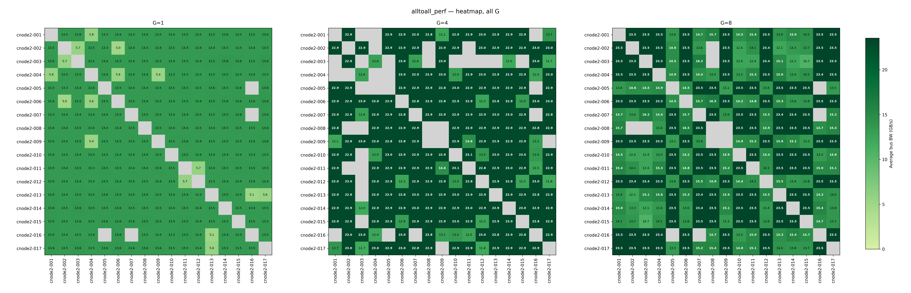

<h1 align="center">
NCCL Tests Cluster
</h1>

<p align="center">
Automated inter-node bandwidth testing and visualization for GPU clusters using NCCL.
</p>

<p align="center">
  
  <br/>
  <sub>Example: 17-node H100 cluster bandwidth heatmap (alltoall_perf)</sub>
</p>

**Key Features:**

- Run **[NCCL Tests](https://github.com/NVIDIA/nccl-tests)** in single-node, multi-node, and pairwise modes
- Parse logs into structured CSV/Markdown reports
- Visualize bandwidth with heatmaps and plots
- Full **[SLURM](https://slurm.schedmd.com/documentation.html)** integration

### Test Types at a Glance

| Test Type       | Purpose                       | Best For                                  |
| --------------- | ----------------------------- | ----------------------------------------- |
| **Single-node** | Intra-node GPU communication  | Verify each node works correctly          |
| **Pairwise**    | All N×(N-1)/2 node pairs      | **Diagnose network issues** between nodes |
| **Multi-node**  | N nodes in one collective job | Benchmark overall cluster performance     |
| **Smoke**       | Quick 2-node sanity check     | Fast validation before full tests         |

### Feature Support Matrix

| Feature         | Single-Node | Pairwise | Multi-Node | Smoke |
| --------------- | :---------: | :------: | :--------: | :---: |
| Run NCCL Tests  |     ✅      |    ✅    |     ✅     |  ✅   |
| Summarize Logs  |     ✅      |    ✅    |     ✅     |  ✅   |
| Bandwidth Plots |     ✅      |    —     |     ✅     |   —   |
| Heatmaps        |      —      |    ✅    |     —      |   —   |

> **Note:** Bandwidth plots show bandwidth vs message size. Single-node compares different nodes; multi-node compares different G values. Heatmaps visualize inter-node bandwidth matrix (requires pairwise data).

## Table of Contents <!-- omit in toc -->

- [Quick Start](#quick-start)
  - [Setup](#setup)
  - [Run Tests](#run-tests)
  - [Wait \& Process](#wait--process)
- [Workflow](#workflow)
- [Output Structure](#output-structure)
- [Prerequisites](#prerequisites)
  - [Clone Repository and Build NCCL](#clone-repository-and-build-nccl)
  - [Python Environment](#python-environment)
- [Usage](#usage)
  - [Run NCCL Tests (Single-Node)](#run-nccl-tests-single-node)
  - [Run NCCL Tests (Pairs)](#run-nccl-tests-pairs)
  - [Run NCCL Tests (Multi-Node)](#run-nccl-tests-multi-node)
  - [Quick Smoke Test](#quick-smoke-test)
  - [Summarize Logs](#summarize-logs)
  - [Generate Bandwidth Plots](#generate-bandwidth-plots)
  - [Generate Heatmaps](#generate-heatmaps)
  - [Generate Plot Gallery](#generate-plot-gallery)
- [Configuration](#configuration)
  - [Default Test Parameters](#default-test-parameters)
  - [Default Test Binaries](#default-test-binaries)
  - [Environment Variable Overrides](#environment-variable-overrides)
- [Limitations](#limitations)
- [Links](#links)
- [Troubleshooting](#troubleshooting)
  - [Common Issues](#common-issues)

## Quick Start

> **All commands run from repository root** (`nccl-tests-cluster/`).

### Setup

```bash
git clone https://github.com/xxrjun/nccl-tests-cluster.git
cd nccl-tests-cluster
bash build_nccl_and_tests.sh
uv venv
source .venv/bin/activate
uv pip install -r requirements.txt
```

### Run Tests

Set your partition and cluster once, then run a test:

```bash
PARTITION="<partition>"
CLUSTER="<cluster>"
bash sbatch_run_nccl_tests_pairs.sh -p "$PARTITION" -c "$CLUSTER" -n "<node-list>"
```

> [!NOTE]
> Node naming differs by cluster. Replace `<node-list>` with your local format, e.g., `-n "node[01-04]"` or `-n "cnode-[001-004]"`.

See [Usage](#usage) for single-node, multi-node, and smoke test examples.

### Wait & Process

```bash
squeue -u "$USER"
python3 summarize_nccl_logs.py --input benchmarks/$CLUSTER/nccl-benchmark-results/pairwise/latest/without-debug/logs
python3 generate_topology.py --csv benchmarks/$CLUSTER/nccl-benchmark-results/pairwise/latest/without-debug/summary.csv --all
python3 generate_plot_gallery.py --clusters "$CLUSTER" --output benchmarks/plot-gallery.html
```

## Workflow

The workflow requires **three separate steps** because SLURM jobs run asynchronously:

1. **Submit** — Run `sbatch_run_nccl_tests_*.sh` to submit SLURM jobs
2. **Wait** — Monitor with `squeue -u $USER` until jobs complete (minutes to hours)
3. **Process** — Run Python scripts to summarize logs and generate visualizations

> Jobs run asynchronously, so you can submit and return later to process results.

## Output Structure

Results are organized by **test type first, then run ID**, so you can browse or cleanly remove entire test classes. Each test type has its own `latest` symlink pointing to the most recent run.

```
nccl-tests-cluster/                    # Repository root (run all commands from here)
├── benchmarks/
│   └── {cluster_name}/
│       └── nccl-benchmark-results/
│           ├── single-node/
│           │   ├── runs/
│           │   │   └── <RUN_ID>/
│           │   │       ├── without-debug/
│           │   │       │   ├── logs/           # Raw NCCL test outputs
│           │   │       │   ├── summary.csv     # Parsed results
│           │   │       │   ├── summary.md      # Markdown table
│           │   │       │   └── plots/          # Bandwidth plots
│           │   │       └── with-debug/
│           │   │           └── ...
│           │   └── latest -> runs/<RUN_ID>     # Relative symlink
│           ├── pairwise/
│           │   ├── runs/<RUN_ID>/
│           │   │   └── without-debug/
│           │   │       ├── logs/
│           │   │       ├── summary.csv
│           │   │       ├── summary.md
│           │   │       ├── failures.txt        # If any tests failed
│           │   │       └── topology/           # Heatmaps
│           │   └── latest -> runs/<RUN_ID>
│           ├── multi-node/
│           │   ├── runs/<RUN_ID>/...
│           │   └── latest -> runs/<RUN_ID>
│           └── smoke/
│               ├── runs/<RUN_ID>/logs
│               └── latest -> runs/<RUN_ID>
├── nccl/
│   ├── build/                         # NCCL build (NCCL_HOME)
│   └── nccl-tests/
│       └── build/                     # NCCL test binaries (NCCL_TEST)
├── lib/
│   └── nccl_common.sh                 # Shared shell functions
├── sbatch_run_nccl_tests_single.sh    # Single-node test script
├── sbatch_run_nccl_tests_pairs.sh     # Pairwise test script
├── sbatch_run_nccl_tests_multi.sh     # Multi-node test script
├── sbatch_run_nccl_tests_smoke.sh     # Quick smoke test script
├── summarize_nccl_logs.py             # Log parser
├── plot_nccl_bandwidth.py             # Bandwidth plot generator
├── generate_topology.py               # Heatmap/topology generator
└── build_nccl_and_tests.sh            # Build script
```

**Notes:**

- The `latest` symlink uses a **relative path** (`runs/<run-id>`) to work correctly from any directory
- Reuse `--run-id` to resume and fill in missing logs for a prior run
- Each test type maintains its own independent `latest` symlink

## Prerequisites

### Clone Repository and Build NCCL

For convenience, it is recommended to clone this repository into `$HOME/` by default. Otherwise, you might need to modify the paths in `sbatch_run_nccl_tests_pairs.sh` accordingly.

```bash
cd $HOME
git clone https://github.com/xxrjun/nccl-tests-cluster.git
cd nccl-tests-cluster
```

> [!TIP]
> This project is built on [NVIDIA/nccl](https://github.com/nvidia/nccl) and [NVIDIA/nccl-tests](https://github.com/NVIDIA/nccl-tests). Please refer to their README files for more information about NCCL and NCCL Tests.
>
> Or use the provided build script `build_nccl_and_tests.sh` to build NCCL and NCCL Tests automatically.

```bash
bash build_nccl_and_tests.sh
```

### Python Environment

Install required packages for log parsing and visualization.

**Option 1: Using [uv](https://docs.astral.sh/uv/) (recommended)**

If you don't have `uv` installed, you can install it via

```bash
curl -LsSf https://astral.sh/uv/install.sh | sh
source $HOME/.local/bin/env
```

Create and activate a virtual environment, then install the required packages

```bash
uv venv
source .venv/bin/activate
uv pip install -r requirements.txt
```

**Option 2: Using pip**:

```bash
python3 -m venv .venv
source .venv/bin/activate
pip install -r requirements.txt
```

## Usage

Common options for all SLURM submission scripts (single, pairwise, multi-node, smoke). Run `bash sbatch_run_nccl_tests_*.sh --help` for the full list.

| Option            | Description                                     | Default                |
| ----------------- | ----------------------------------------------- | ---------------------- |
| `-p, --partition` | SLURM partition name                            | Required               |
| `-c, --cluster`   | Cluster name for log organization               | `cluster00`            |
| `-n, --nodelist`  | Compressed nodelist (e.g., `"cnode-[001-004]"`) | All nodes in partition |
| `-r, --run-id`    | Run ID for timestamped results                  | `YYYYMMDD-HHMMSS`      |
| `--gpn`           | Space- or comma-separated GPU counts            | Script defaults        |
| `--dry-run`       | Preview commands without submitting             | `false`                |
| `--debug`         | Enable NCCL debug mode (affects performance)    | `false`                |

### Run NCCL Tests (Single-Node)

Test intra-node GPU communication performance on individual nodes.

```bash
bash sbatch_run_nccl_tests_single.sh -p <partition> -c cluster00

bash sbatch_run_nccl_tests_single.sh -p <partition> -c cluster00 -n "cnode-[001-004]"
```

**Example output:**

```bash
Submitting 4 single-node jobs...
  cnode-001
  cnode-002
  cnode-003
  cnode-004
Submit: NCCL_N1_G4_cnode-001  --nodelist=cnode-001  --gpus-per-node=4
Submitted batch job 1234
# ...
==========================================
Submission Summary
==========================================
Total nodes:    4
Jobs per node:  2
Total jobs:     8
Submitted:      8
Skipped:        0
DRY RUN:        0
NCCL DEBUG:     0
==========================================
```

### Run NCCL Tests (Pairs)

Test inter-node GPU communication performance across all node pairs.

```bash
bash sbatch_run_nccl_tests_pairs.sh -p <partition> -c cluster00

bash sbatch_run_nccl_tests_pairs.sh -p <partition> -c cluster00 -n "cnode-[001-004]"
```

> [!TIP]
> It is highly recommended to first test with only two nodes to verify that your NCCL environment is working correctly:
>
> ```bash
> bash sbatch_run_nccl_tests_pairs.sh -p <partition> -c cluster00 -n "cnode-[001-002]"
> ```

**Example output:**

```bash
Submitting 6 pairs...
  cnode-001,cnode-002
  cnode-001,cnode-003
  # ...
==========================================
Submission Summary
==========================================
Total pairs:    6
Jobs per pair:  4
Total jobs:     24
Submitted:      24
Skipped:        0
DRY RUN:        0
NCCL DEBUG:     0
==========================================
```

**Cancel jobs if needed:**

```bash
scancel -u $USER
```

### Run NCCL Tests (Multi-Node)

Run one NCCL job across N>=2 nodes (not all pair combinations).

```bash
bash sbatch_run_nccl_tests_multi.sh -p <partition> -c cluster00 --num-nodes 4 --gpn "8"

bash sbatch_run_nccl_tests_multi.sh -p <partition> -c cluster00 -n "cnode-[001-004]"
```

### Quick Smoke Test

Fast two-node sanity check (all_reduce_perf + sendrecv_perf, small message sizes).

```bash
bash sbatch_run_nccl_tests_smoke.sh -p <partition> -c cluster00
```

### Summarize Logs

Parse NCCL test logs and generate summary reports (CSV + Markdown). All paths are resolved automatically (symlinks included), so commands work from the repository root.

```bash
python3 summarize_nccl_logs.py \
  --input benchmarks/<cluster-name>/nccl-benchmark-results/single-node/latest/without-debug/logs

# Custom output paths
python3 summarize_nccl_logs.py \
  --input benchmarks/.../logs \
  --save-csv /path/to/summary.csv \
  --save-md  /path/to/summary.md
```

Run `python3 summarize_nccl_logs.py --help` for all options.

**Filename Format:**

- Single-node: `..._N1_G{G}_node.log` (e.g., `nccl_N1_G8_cnode-001.log`)
- Pairs: `..._N2_G{G}_node1_node2.log` (e.g., `nccl_N2_G8_cnode-005_cnode-006.log`)
- Multi-node: `..._N{N}_G{G}.log` (e.g., `nccl_N4_G8.log`)
- The `_debug` suffix is automatically ignored

### Generate Bandwidth Plots

Generate bandwidth vs message size plots for visualizing NCCL performance trends. All paths are resolved automatically (symlinks included), so commands work from the repository root.

```bash
python3 plot_nccl_bandwidth.py \
  --input benchmarks/<cluster-name>/nccl-benchmark-results/single-node/latest/without-debug/logs

python3 plot_nccl_bandwidth.py --input ./logs --test all_reduce_perf --g 8 --metric algbw --save-csv detailed_data.csv
```

**Output:** `plots/{test_name}/G{n}_{node}.png` (individual) + `G{n}_combined.png` (comparison)

**Key Options (see `--help` for full list):**

| Option            | Description                                   |
| ----------------- | --------------------------------------------- | ----------------------------------- |
| `--test NAME`     | Filter by test name (e.g., `all_reduce_perf`) |
| `--g N`           | Filter by GPU count                           |
| `--metric {busbw  | algbw}`                                       | Bandwidth metric (default: `busbw`) |
| `--out-dir DIR`   | Custom output directory                       |
| `--save-csv FILE` | Export per-message-size data to CSV           |

### Generate Heatmaps

Visualize network bandwidth with heatmaps from `summary.csv`. By default, only heatmaps are generated; topology graphs require the `--topology` flag. All paths are resolved automatically (symlinks included), so commands work from the repository root.

```bash
python3 generate_topology.py \
  --csv benchmarks/<cluster-name>/nccl-benchmark-results/pairwise/latest/without-debug/summary.csv \
  --all

python3 generate_topology.py --csv ./summary.csv --all --topology
```

**Output:** `topology/{test_name}/G{n}_heatmap.png` and `allG_heatmap.png` by default; add `--topology` to also generate `G{n}.png` + `allG.png` (combined grid)

**Key Options (see `--help` for full list):**

| Option                  | Description                                                                        |
| ----------------------- | ---------------------------------------------------------------------------------- | ----- | ------------------------------------------------------------ |
| `--all`                 | Process all tests and G values                                                     |
| `--test NAME`           | Process specific test only                                                         |
| `--topology`            | Also generate topology graphs in addition to heatmaps                              |
| `--layout NAME`         | Layout algorithm (`kamada`, `shell`, `spring`, `circular`, `bipartite`, `cluster`) |
| `--heatmap-values {auto | on                                                                                 | off}` | Show numbers in heatmap cells (default `auto` for ≤20 nodes) |
| `--vmin/--vmax`         | Bandwidth color scale range                                                        |

### Generate Plot Gallery

Create an HTML or Markdown gallery to browse plots across clusters, test types, and runs. The gallery scans
`benchmarks/<cluster>/...` for images under `plots/` (bandwidth) and `topology/` (heatmaps).

```bash
# HTML gallery (default: benchmarks/plot-gallery.html)
python3 generate_plot_gallery.py

# Filter to specific clusters
python3 generate_plot_gallery.py --clusters cluster01,cluster02 --output benchmarks/plot-gallery.html
```

**Key Options (see `--help` for full list):**

| Option            | Description                              |
| ----------------- | ---------------------------------------- | ------------------------------- |
| `--clusters LIST` | Comma-separated cluster names to include |
| `--format {html   | md}`                                     | Output format (default: `html`) |
| `--output FILE`   | Output path                              |
| `--no-plots`      | Exclude bandwidth plots                  |
| `--no-topology`   | Exclude topology heatmaps                |
| `--dpi`           | Resolution (default: 300)                |

Run `python3 generate_plot_gallery.py --help` for all options.

## Configuration

Each script has sensible defaults that can be overridden via environment variables or CLI options.

### Default Test Parameters

| Parameter               | Single-Node | Pairwise   | Multi-Node | Smoke    |
| ----------------------- | ----------- | ---------- | ---------- | -------- |
| `MAXIMUM_TRANSFER_SIZE` | 16G         | 16G        | 16G        | 512M     |
| `MINIMUM_TRANSFER_SIZE` | 32M         | 4G         | 32M        | 32M      |
| `STEP_FACTOR`           | 2           | 2          | 2          | 2        |
| `ITERS_COUNT`           | 20          | 20         | 20         | 5        |
| `WARMUP_ITERS`          | 5           | 5          | 5          | 2        |
| `JOB_TIME_LIMIT`        | 00:30:00    | 00:50:00   | 00:50:00   | 00:05:00 |
| GPU counts (`--gpn`)    | 4, 8        | 1, 2, 4, 8 | 1, 2, 4, 8 | 1        |

> **Note**: `JOB_TIME_LIMIT` format is `HH:MM:SS` (hours:minutes:seconds).

### Default Test Binaries

| Script      | Default Binaries                                                                              |
| ----------- | --------------------------------------------------------------------------------------------- |
| Single-Node | `all_reduce_perf`, `all_gather_perf`, `reduce_scatter_perf`, `alltoall_perf`, `sendrecv_perf` |
| Pairwise    | `alltoall_perf`, `sendrecv_perf`                                                              |
| Multi-Node  | `all_reduce_perf`, `all_gather_perf`, `reduce_scatter_perf`, `alltoall_perf`, `sendrecv_perf` |
| Smoke       | `all_reduce_perf`, `sendrecv_perf`                                                            |

### Environment Variable Overrides

Override any default by setting environment variables before running scripts:

```bash
# Example: Custom transfer sizes and iterations
MAXIMUM_TRANSFER_SIZE=8G MINIMUM_TRANSFER_SIZE=1G ITERS_COUNT=50 \
  bash sbatch_run_nccl_tests_pairs.sh -p <partition> -c cluster00

# Example: Custom test binaries
RUN_BIN_LIST="all_reduce_perf alltoall_perf" \
  bash sbatch_run_nccl_tests_single.sh -p <partition> -c cluster00
```

## Limitations

- **Scheduler**: SLURM only
- **GPU/NIC selection**: Manual configuration via environment variables (e.g., `CUDA_VISIBLE_DEVICES`, `NCCL_SOCKET_IFNAME`)
- **Large clusters**: Heatmaps become crowded (>20 nodes)

## Links

- [NVIDIA NCCL Documentation](https://docs.nvidia.com/deeplearning/nccl/user-guide/docs/index.html)
- [NCCL GitHub Issues](https://github.com/NVIDIA/nccl/issues)
- [NCCL Tests GitHub](https://github.com/NVIDIA/nccl-tests)
- [[2507.04786] Demystifying NCCL: An In-depth Analysis of GPU Communication Protocols and Algorithms](https://arxiv.org/abs/2507.04786)
- [[2510.20171] Collective Communication for 100k+ GPUs](https://arxiv.org/abs/2510.20171)

## Troubleshooting

> [!TIP]
> If you encounter issues related to NCCL, it is highly recommended to search for or post your questions on [NCCL GitHub Issues](https://github.com/NVIDIA/nccl/issues) and [NCCL Tests GitHub Issues](https://github.com/NVIDIA/nccl-tests/issues).

### Common Issues

**"No .log files found" when running Python scripts:**

This typically means the path doesn't exist or the symlink is broken. Verify the path:

```bash
# Check if the path exists and symlinks are valid
ls -la benchmarks/<cluster-name>/nccl-benchmark-results/pairwise/latest

# If the symlink is broken, it should point to "runs/<run-id>" (relative path)
# Correct symlink example: latest -> runs/20260128-010702
# Broken symlink example: latest -> benchmarks/.../runs/20260128-010702 (full path)

# To fix a broken symlink:
cd benchmarks/<cluster-name>/nccl-benchmark-results/pairwise
rm latest
ls runs/  # Find the correct run ID
ln -sfn runs/<run-id> latest
```

The Python scripts use `os.path.realpath()` to resolve symlinks, so they will work correctly as long as the symlink target exists. You can also use the absolute path directly:

```bash
python3 summarize_nccl_logs.py \
  --input benchmarks/<cluster-name>/nccl-benchmark-results/pairwise/runs/<run-id>/without-debug/logs
```

**Single-node tests succeed but multi-node tests fail:**

Try specifying the network interface used for communication:

```bash
export NCCL_SOCKET_IFNAME=<iface>
```

**Low bandwidth with small transfer sizes:**

If average bus bandwidth is significantly below theoretical limits when using small transfer sizes (e.g., 32 MB), consider increasing `MINIMUM_TRANSFER_SIZE` in scripts (default: 32M). Larger transfer sizes typically achieve higher sustained bandwidth.

**Gray blocks in heatmap (or red lines in topology graphs):**

These indicate failed tests or missing data. Check the corresponding log files for detailed error messages:

```bash
# Check for error files
ls -la benchmarks/<cluster-name>/nccl-benchmark-results/pairwise/latest/without-debug/logs/*.err

# View specific error
cat benchmarks/<cluster-name>/nccl-benchmark-results/pairwise/latest/without-debug/logs/<job>.err
```

**Multiple processes using the same Rank:**

If you see multiple processes using the same Rank in the logs, ensure that you compile NCCL Tests with MPI support enabled:

```bash
# Example log output showing the problem:
# Rank  0 Group  0 Pid 223120 on cnode2-002 device  0 [0000:1b:00] NVIDIA H100 80GB HBM3
# Rank  0 Group  0 Pid 223121 on cnode2-002 device  0 [0000:1b:00] NVIDIA H100 80GB HBM3
# ...

# Fix: Rebuild NCCL Tests with MPI support
module load openmpi
cd nccl/nccl-tests
make clean
make MPI=1
```
