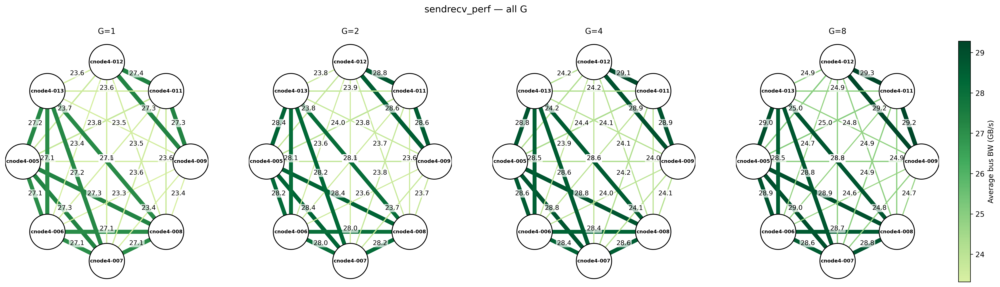
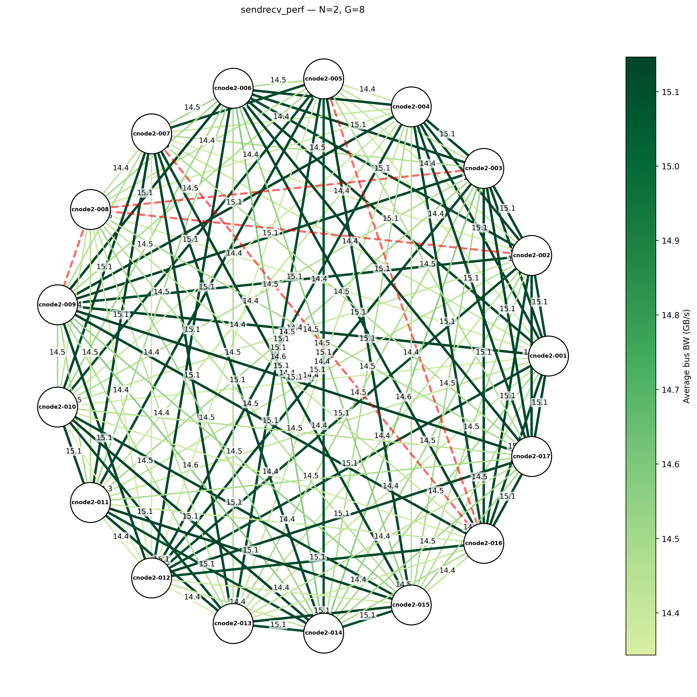

<h1 align="center">
NCCL Tests Cluster
</h1>

<p align="center">
Automated Inter-node bandwidth testing and visualization for GPU clusters using NCCL.
</p>

<p align="center">
  
  <p align="center" style="font-size: 10pt">Example topology graph of an 8-node H100 cluster, with 8 GPUs per node. (alltoall_perf)</p>
  <!-- 
  <figcaption style="margin-top:0.5em;">Example topology graph of an 8-node H100 cluster, with 8 GPUs per node. (sendrecv_perf, G=8)</figcaption> -->
</p>

**Key Features:**

- Run pairwise NCCL tests across all node combinations
- Parse logs and generate summary reports (CSV/Markdown)
- Visualize network topology with bandwidth graphs
- Support for SLURM clusters

**Testing Strategy:** For N nodes, test all pairs (e.g., 4 nodes → 6 pairs: A-B, A-C, A-D, B-C, B-D, C-D). Intra-node tests should be run separately on each node.

## Table of Contents <!-- omit in toc -->

- [Motivation](#motivation)
- [Limitations](#limitations)
- [Project Structure](#project-structure)
- [Prerequisites](#prerequisites)
  - [Clone Repository and Build NCCL](#clone-repository-and-build-nccl)
  - [Python Environment](#python-environment)
- [Usage](#usage)
  - [Run NCCL Tests Pairs](#run-nccl-tests-pairs)
  - [Summarize Logs](#summarize-logs)
  - [Generate Topology Graphs](#generate-topology-graphs)
- [Useful Links](#useful-links)
- [Troubleshooting](#troubleshooting)
- [Known Issues](#known-issues)

## Motivation

[NVIDIA’s NCCL Tests](https://github.com/NVIDIA/nccl-tests) already provides a reliable and privilege-free way to benchmark GPU communication performance. However, in real-world HPC or cloud environments, users without administrative access often face limited visibility into the system. Tools such as **NVIDIA DCGM**, **nvtop**, or low-level network profilers are typically unavailable, making it difficult to obtain a clear picture of inter-node communication performance.

This raises a practical challenge:

**How can we systematically evaluate and visualize inter-node bandwidth patterns in a GPU cluster without relying on administrative tools or privileges?**

_NCCL Tests Cluster_ bridges this gap by automating and extending NCCL Tests for scalable, user-level performance evaluation. It enables users to:

- **Automatically run pairwise NCCL benchmarks** across all node combinations
- **Parse and summarize logs** into structured CSV/Markdown reports
- **Visualize network topology** with bandwidth-based heatmaps and graphs

Together, these capabilities extend NCCL testing into a fully automated and scalable workflow—making it easier to verify cluster health, identify communication bottlenecks, and optimize resource allocation even without system-level monitoring tools.

## Limitations

- **Scheduler**: Only [SLURM](https://slurm.schedmd.com/documentation.html) is supported currently
- **GPU/NIC Selection**:
  - No automatic testing of all GPU/NIC combinations
  - Manual configuration via environment variables (e.g., `CUDA_VISIBLE_DEVICES`, NCCL variables) is possible
  - GPU/NIC details are only visible in debug logs (`--debug` enables `NCCL_DEBUG=INFO`)
- **Test Configuration**: Only pairwise (N=2) tests supported

## Project Structure

```bash
build_nccl_and_tests.sh
sbatch_run_nccl_tests_pairs.sh
summarize_nccl_logs.py
generate_topology.py
benchmarks
  {cluster_name}/         # e.g., cluster00: 8 nodes × 8 H100 GPUs each
    nccl-tests-pairs/
      with-debug/
        logs/
        topology/
          alltoall_perf/
          sendrecv_perf/
          ... (others)
        summary.csv
        summary.md
      without-debug/
        (same as above)
  {cluster_name2}/
nccl/
  build/                  # Compiled NCCL library (NCCL_HOME)
  nccl-tests/
    build/                # Compiled NCCL test binaries (NCCL_TEST)
```

## Prerequisites

### Clone Repository and Build NCCL

For convenience, it is recommended to clone this repository into `$HOME/` by default. Otherwise, you might need to modify the paths in `sbatch_run_nccl_tests_pairs.sh` accordingly.

```bash
cd $HOME
git clone https://github.com/xxrjun/nccl-tests-cluster.git
cd nccl-tests-cluster
```

> [!TIP]
> This project is build on [NVIDIA/nccl](https://github.com/nvidia/nccl) and [NVIDIA/nccl-tests](https://github.com/NVIDIA/nccl-tests). Please refer to their README files for more information about NCCL and NCCL tests.
>
> Or you can run with the provided build script `build_nccl_and_tests.sh` to build NCCL and NCCL tests automatically.

```bash
bash build_nccl_and_tests.sh
```

### Python Environment

Install required packages for log parsing and topology visualization.

**Option 1: Using [uv](https://docs.astral.sh/uv/) (recommended)**

If you don't have `uv` installed, you can install it via

```bash
curl -LsSf https://astral.sh/uv/install.sh | sh
source $HOME/.local/bin/env
```

Create and activate a virtual environment, then install the required packages

```bash
uv venv
source .venv/bin/activate
uv pip install -r requirements.txt
```

**Option 2: Using pip**:

```bash
pip install -r requirements.txt
```

## Usage

### Run NCCL Tests Pairs

View all options to use CLI script.

```bash
bash sbatch_run_nccl_tests_pairs.sh --help
```

Or modify the **SLURM and Test Settings** section in the script to configure partition, nodes, GPUs, and test parameters as needed. Then run the script to submit jobs.

> It is highly recommended to use only two nodes to verify that your NCCL environment is working correctly.

```bash
bash sbatch_run_nccl_tests_pairs.sh
```

After execution, you should see a summary table similar to the following:

```bash
# ...
Submitted batch job 1215
Submitted 1088 jobs. (0 skipped due to existing logs.)
Total pairs: 136. Total jobs: 1088.
==========================================
Submission Summary
==========================================
Total pairs:    136
Jobs per pair:  8
Total jobs:     1088
Submitted:      1088
Skipped:        0
DRY RUN:        0
NCCL DEBUG:     0
==========================================
```

If necessary, you can cancel all running jobs using the following command

```bash
scancel -u $USER
```

### Summarize Logs

Parse NCCL test logs and generate summary reports (CSV + Markdown).

```bash
# Process single directory
python summarize_nccl_logs.py --input benchmarks/cluster01/nccl-tests-pairs/with-debug/logs

# Batch mode: process both with-debug/ and without-debug/
python summarize_nccl_logs.py --input benchmarks/cluster01/nccl-tests-pairs/

# Custom output paths
python summarize_nccl_logs.py \
  --input benchmarks/.../logs \
  --save-csv /path/to/summary.csv \
  --save-md  /path/to/summary.md
```

**Filename Format:** `..._N{N}_G{G}_node1_node2.log`

- Example: `nccl_N2_G8_cnode4-005_cnode4-006.log`
- The `_debug` suffix is automatically ignored

### Generate Topology Graphs

Visualize network topology with bandwidth heatmaps from `summary.csv`.

```bash
# Process all tests and G values (recommended)
python generate_topology.py --csv benchmarks/cluster01/nccl-tests-pairs/without-debug/summary.csv --all

# Single test, all G values
python generate_topology.py --csv ./summary.csv --test alltoall_perf

# With custom styling
python generate_topology.py --csv ./summary.csv --all \
  --vmin 0 --vmax 80 --layout shell --adjust-labels
```

**Output:** `topology/{test_name}/G{n}.png` + `allG.png` (combined grid)

**Key Options:**

- `--all`: Process all tests and G values
- `--test NAME`: Process specific test only
- `--adjust-labels`: Auto-adjust overlapping labels (useful for dense graphs)
- `--layout`: Algorithm (`kamada`, `shell`, `spring`, `circular`, `bipartite`, `cluster`)
- `--vmin/--vmax`: Bandwidth color scale range
- `--dpi`: Resolution (default: 300)

Run `python generate_topology.py --help` for all options.

## Useful Links

- [docs] [NVIDIA NCCL Documentation](https://docs.nvidia.com/deeplearning/nccl/user-guide/docs/index.html)
- [paper] [[2507.04786] Demystifying NCCL: An In-depth Analysis of GPU Communication Protocols and Algorithms](https://arxiv.org/abs/2507.04786)

## Troubleshooting

> [!TIP]
> If you encounter issues related to NCCL, it's highly recommended to search or ask questions on [NCCL GitHub Issues](https://github.com/NVIDIA/nccl/issues) and [NCCL Tests GitHub Issues](https://github.com/NVIDIA/nccl-tests/issues).

- If single-node tests succeed but multi-node tests fail, try specifying the network interface for communication:

  ```bash
  export NCCL_SOCKET_IFNAME=<iface>
  ```

- If you find red lines in the topology graphs, it indicates failed tests or missing data. Check the corresponding log files for errors.

  
    <p style="font-size: 10pt">Example topology graph of an 17-node H100 cluster, with 8 GPUs per node. (sendrecv_perf)</p>

## Known Issues

- For large clusters, the topology becomes too crowded and hard to identify the performance differences between groups (if any). Consider splitting the cluster into smaller sub-clusters for better visualization. It is be planned to add better support for large clusters in future releases.
